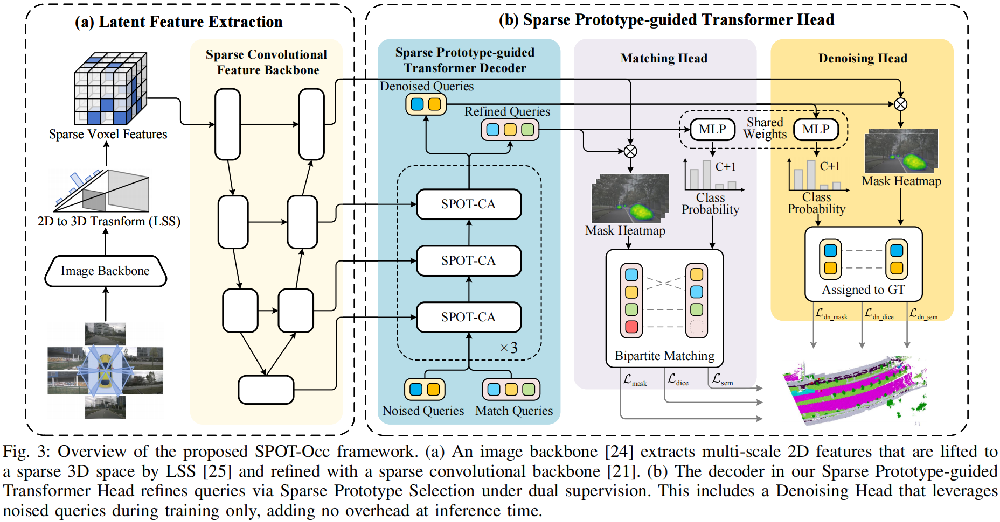
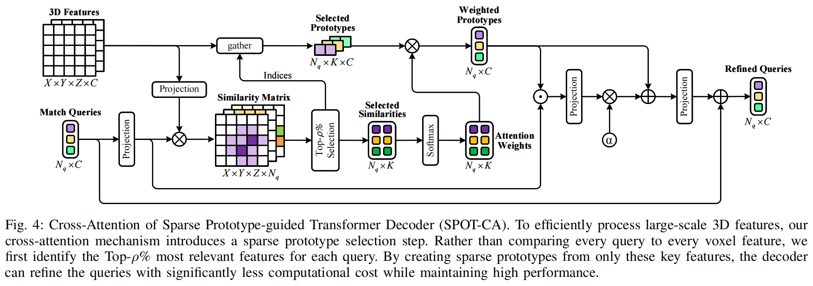
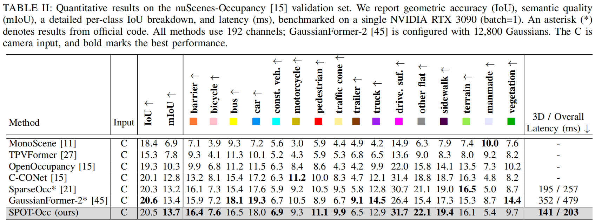
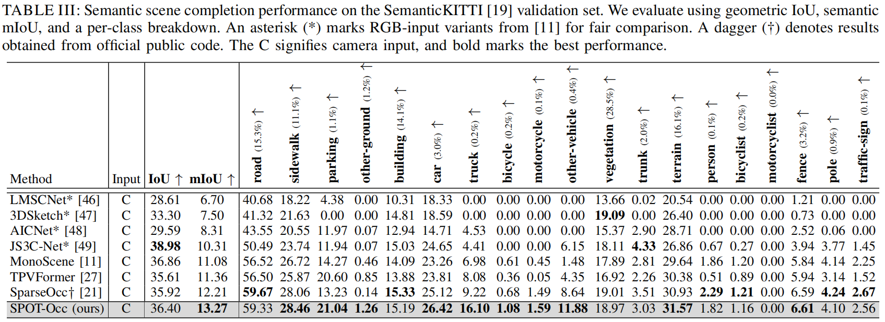

# SPOT-Occ: Sparse Prototype-guided Transformer for Camera-based 3D Occupancy Prediction

## Abstract
Achieving highly accurate and real-time 3D occupancy prediction from cameras is a critical requirement for the safe and practical deployment of autonomous vehicles. While this shift to sparse 3D representations solves the encoding bottleneck, it creates a new challenge for the decoder: how to efficiently aggregate information from a sparse, non-uniformly distributed set of voxel features without resorting to computationally prohibitive dense attention. In this paper, we propose a novel Prototype-based Sparse Transformer Decoder that replaces this costly interaction with an efficient, two-stage process of guided feature selection and focused aggregation. Our core idea is to make the decoder's attention prototype-guided. We achieve this through a sparse prototype selection mechanism, where each query adaptively identifies a compact set of the most salient voxel features, termed prototypes, for focused feature aggregation. To ensure this dynamic selection is stable and effective, we introduce a complementary denoising paradigm. This approach leverages ground-truth masks to provide explicit guidance, guaranteeing a consistent query-prototype association across decoder layers. Our model, dubbed SPOT-Occ, outperforms previous methods with a significant margin in speed while also improving accuracy.

## Demo

## Benchmark Results
Occupancy Prediction on OpenOccupancy validation set:

Semantic Scene Completion on SemanticKITTI validation set:

## Model Zoo
We provide the pretrained weights on SemanticKITTI and nuScenes datasets.

| Model | Dataset | Backbone | SSC mIoU | Model Weight | Training Log | Inference Log |
| :--- | :--- | :--- | :---: | :---: | :---: | :---: |
| [SparseOcc (Baseline)](projects/configs/baseline/sparseocc_nusc_256.py) | nuScenes | ResNet50 | 13.2 | [Link](https://pan.baidu.com/s/1Baydxdv1CaGSpSeXmy9i2Q?pwd=96rg) | [Link](log/training/nusc_origin_tr.log) | [Link](log/inference/nusc_origin_in.md) |
| [SpotOcc (Ours)](projects/configs/spotocc/spotocc_nusc_256.py) | nuScenes | ResNet50 | 13.7 | [Link](https://pan.baidu.com/s/1rkY-oBFtxntrNWSI5bZM0A?pwd=spot) | [Link](log/training/nusc_spot_tr.log) | [Link](log/inference/nusc_spot_in.md) |
| [SparseOcc (Baseline)](projects/configs/baseline/sparseocc_kitti.py) | SemanticKITTI | EfficientNetB7 | 12.2 | [Link](https://pan.baidu.com/s/1g8xYs1xQWcD1xqmf7cX9HA?pwd=mgpj) | [Link](log/training/kitti_origin_tr.log) | [Link](log/inference/kitti_origin_in.md) |
| [SpotOcc (Ours)](projects/configs/spotocc/spotocc_kitti.py) | SemanticKITTI | EfficientNetB7 | 13.3 | [Link](https://pan.baidu.com/s/1HulqJSy01L_2Pi10ldwH_A?pwd=spot) | [Link](log/training/kitti_spot_tr.log) | [Link](log/inference/kitti_spot_in.md) |

## Getting Started

- [installation](docs/install.md)

- [data_preparation](docs/prepare_dataset.md)

- [train_and_eval](docs/train_and_eval.md)

## Acknowledgement

This project is developed based on the following open-sourced projects: [BEVDet](https://github.com/HuangJunJie2017/BEVDet), [BEVFormer](https://github.com/fundamentalvision/BEVFormer), [Mask2Former](https://github.com/facebookresearch/Mask2Former), [OccFormer](https://github.com/zhangyp15/OccFormer), [OpenOccupancy](https://github.com/JeffWang987/OpenOccupancy), [SparseOcc](https://github.com/VISION-SJTU/SparseOcc). Thanks for their excellent work.
